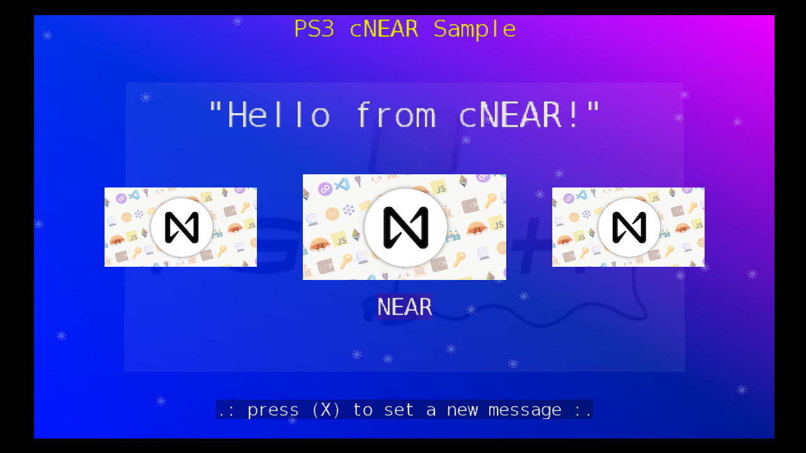

# PS3 NEAR Sample App

This is a sample application for the PlayStation 3 that demonstrates how to interact with the NEAR blockchain using the cNEAR library. 

## Features

- Call a smart contract on the NEAR blockchain and get the current state.
- Call a smart contract on the NEAR blockchain and set a new state.
- Display the current state on the screen.
- Input a new state using the on-screen keyboard.

## Download

[Download the `sample-ps3.pkg`](https://drive.google.com/file/d/1iR_aaH7BPIGA9_HHKJI1S6nVyR-vNhcM/view?usp=sharing) file.

## How to use

- Install the .pkg file on your PS3. (You can also use an emulator like RPCS3)
- Run the application.
- Press `X` to open the on-screen keyboard and set a new greeting message on the `demo-devhub-vid102.testnet` smart contract.
- Wait for the transaction to be confirmed on the blockchain, and the new message will be displayed on the screen.
- Press `O` to exit the application.

## Build

To build the project, you need to have:

- [PS3 toolchain](https://github.com/ps3dev/ps3toolchain)
- [PSL1GHT](https://github.com/ps3dev/PSL1GHT/) SDK
- [cNEAR](https://github.com/bucanero/cnear-poc) library
- [Tiny3D](https://github.com/wargio/tiny3D/) library
- [libcurl](https://github.com/bucanero/ps3libraries/blob/master/scripts/016-libcurl-7.64.1.sh) library
- [polarSSL](https://github.com/bucanero/ps3libraries/blob/master/scripts/015-polarssl-1.3.9.sh) library

## Credits

Based on the [PS3LoadX](https://github.com/bucanero/ps3loadx/) source code by [Hermes](http://www.elotrolado.net).

## License

This example is released under the [MIT License](LICENSE).
